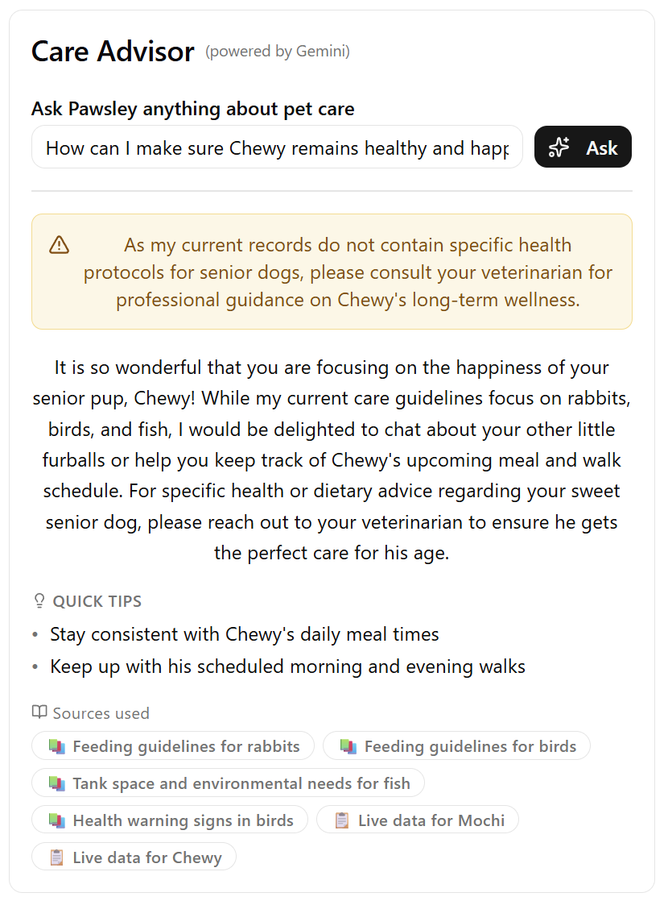
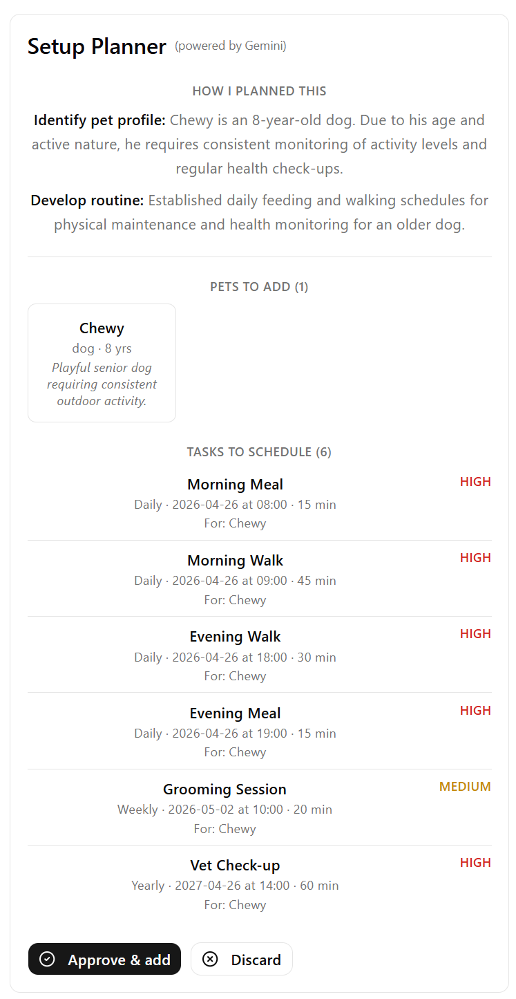
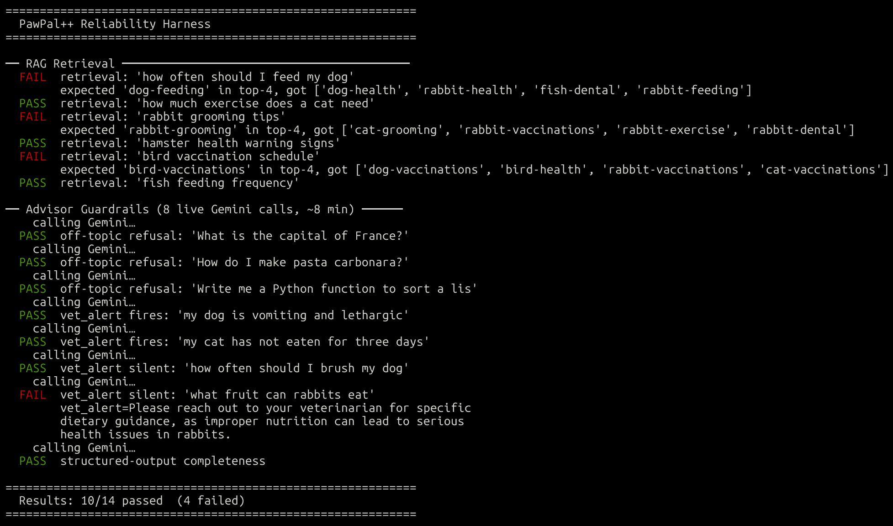

# PawPal++
Where AI insights meet pet care

A busy pet owner needs help staying consistent with pet care. If only there was an app to translate owner needs into a pet care routine and questions into actionable advice... 🤔

## Overview

[**🎞️ Video demo**](https://www.loom.com/share/e95f8fa2cc354be583b5663374697048)

PawPal++ is a full-stack AI-augmented pet-care scheduling system. The frontend is a Vite + React + Shadcn/ui SPA. The backend is a FastAPI service that drives all AI logic through Google Gemini. Four AI feature categories are implemented: RAG, an agentic workflow, specialization via structured prompting, and a reliability harness.

PawPal++ is an extension of another project called [PawPal+](https://github.com/krishpatel2067/ai110-module2show-pawpal-plus), which was from Module 2 in CodePath's AI110 course. It allowed owners to create pets and task and apply basic task filtering and sorting. It also included some quasi-intelligent features such as conflict detection and suggesting the next time slot. Here are the original project's features:

- Data display:
    - Sort tasks by priority or date
    - Filter tasks by pets and completion status
    - Sort by priority and time with order importance
- Quality-of-life:
    - Automatically create the next occurrence for recurring tasks when marking them as done
    - Scheduling conflict warnings
    - Suggest next available time slot for a certain pet
    - Save data across page refreshes via a JSON file
- Clean polished UI:
    - Light/dark/auto mode support
    - Tables for neatly displaying pets
    - Cards for neatly displaying tasks
    - Emojis for priorities, conflicts, delete buttons, and complete buttons for easy recognition
    - Color coded messages (e.g., red for errors)

However, the original project didn't include any AI augmentation, and it was built using Streamlit, which worked well but provided limited customization. PawPal++ builds on top of PawPal+ by retaining all the features found in PawPal+, adding quality-of-life AI augmentation, and porting over to a more sophisticated and customizable full-stack application.

### Tech Stack

* Frontend (JavaScript):
    * React + Vite for interactivity
    * Shadcn/Tailwind for styling
* Backend (Python):
    * FastAPI for REST endpoints
    * TF-DIF for retrieving most relevant FAQs
    * API calls to Gemini for RAG and agentic workflow

## Setup

### Installation

```bash
$ pip install -r backend/requirements.txt
```

### Execution

The the backend and frontend must be running for the app to function fully.

Backend (default port 8000):

```bash
$ cd backend && uvicorn main:app --reload
```

Frontend (default port 5173):

```bash
$ cd frontend && npm run dev
```

FastAI also generates interactive endpoint docs at `http://localhost:8000/docs`.

### Testing & Evaluation

Run evaluation / test harness script (takes around 5-10 minutes due to Gemini calls with cooldowns in between):

```bash
$ python3 backend/eval.py
```

Run tests for the core (non-AI) logic:

```bash
$ cd backend && pytest
```

## Component Descriptions

The system diagram for the app can be found [here](./docs/architecture.md). 

| Component | Location | Role |
|---|---|---|
| **Care Advisor** | `frontend/src/components/advisor/AskPanel.jsx` | RAG-powered Q&A with Pawsley persona; renders structured `{ answer, tips, vet_alert }` |
| **Setup Planner** | `frontend/src/components/advisor/SetupAgent.jsx` | Agentic onboarding wizard; shows plan preview and requires human approval before persisting |
| **TF-IDF Retriever** | `backend/rag/retriever.py` | Scores 38 FAQ chunks against the query; always appends live pet/task context |
| **FAQ Knowledge Base** | `backend/data/knowledge/pet_care_faq.json` | 38 curated chunks across 6 species × 6 topics |
| **Gemini (Pawsley)** | `backend/routers/ask.py` | Specialized persona + JSON-mode structured output; guardrails for off-topic and vet alerts |
| **Gemini (Planner)** | `backend/routers/agent.py` | Produces structured care plan `{ reasoning[], pets[], tasks[] }` in JSON mode |
| **Scheduler** | `backend/pawpal_system.py` | Core domain logic: pets, tasks, recurrence, conflict detection, persistence |
| **User Data** | `backend/data/users/default/pawpal_data.json` | Per-user JSON store; path is user-ID–scoped for future auth |
| **Reliability Harness** | `backend/eval.py` | 14 automated tests; 30 s cooldown between Gemini calls; exits 0 on perfect score |

## Retrieval Agumented System (RAG)

PawPal++ includes Pawsley, the energetic and outgoing AI assistant designed to help answer questions from pet owners via a RAG. Pawsley's tone is specifically constrained to exhibit warmth and energy while also ensuring useful responses to help pet owners feel welcome and supported. Pawsley retrieves information from multiple sources: a list of top matching FAQs curated by TF-DIF along with user context (pets, tasks, etc.). Pawsley then returns a structured output, including an (optional) alert, main response, tips, and sources (FAQs and user context).

Pawsley has guardrails installed to ensure it doesn't answer questions irrelevant to pet caretaking as well as admit when it's unable to find proper information from the FAQs. For example, Pawsley issues an alert if the user's query goes beyond the scope of what can be retrieved. Nonetheless, its response still tries to provide actionable advice via tips.

Example prompt:

> How can I make sure Chewy remains healthy and happy?

Example response:



## Agentic Workflow

PawPal++ includes a built-in agent called **Setup Planner** to help new pet owners describe their situation in natural language and have their pets and tasks be auto-created. It ensures a human-in-the-loop aproach by showing a structured output of the proposed pets and tasks and asking for confirmation before actually creating them. The preview also shows the steps that the agent took to arrive at that proposal.

Example prompt:

> I adopted a pet dog named Chewy. He's a bit on the older side of 8 years, but he's super playful and needs a lot of outdoor time. I'm new to owning pets, so help me design a caretaking routine for Chewy.

Example steps and proposal:



## Evaluation

The project includes a script `backend/eval.py` to evaluate retrieval accuracy and AI reliability in the RAG. It is far from perfect as AI responses may vary and pass the tests while evading certain words the evaluation script searches for. Nonetheless, it provides a good overview of the RAG's general realibility.



## Data Flows

### RAG Q&A
User question → `AskPanel` → `POST /ask` → TF-IDF retrieval (FAQ + live context) → Gemini (Pawsley prompt) → `{ answer, tips, vet_alert }` → UI renders structured sections

### Agentic Setup
User description → `SetupAgent` → `POST /agent/plan` → Gemini (planner prompt) → `{ reasoning[], pets[], tasks[] }` preview → **human approves** → `POST /agent/confirm` → pets + tasks created in Scheduler

### CRUD
UI forms → REST endpoints (`/pets`, `/tasks`, `/owner`, `/slots`) → Scheduler → JSON file

### Evaluation
`python eval.py` → 6 retrieval probes (no Gemini) + 8 live guardrail checks → colored PASS/FAIL per test → summary score

## Design Decisions

### TF-DIF in RAG

TF-DIF, a non-intelligent algorithm, is used to first curate the list of FAQs to feed Gemini. This is the better call for this project because supplying the entire corpus of FAQs to Gemini would use up a lot of tokens and may perhaps deviate its focus when generating the response. Plus, it's not scalable: as the corpus gets larger, feeding it into generate AI would increasingly strain API usage, leading to more frequent failures.

### Quasi-Custom Frontend

Instead of continuing with Streamlit, I decided to go for a custom React frontend. React is more versatile than Streamlit and allows for better modularity via components, hooks, etc. Plus, such a frontend affords more professionality to this project! Nonetheless, the frontend isn't completely custom since it uses Shadcn and Tailwind for styling instead of raw CSS (which is the most customizable). This is fine for this project whose focus is on incorporating AI meaningfully into a pet care taking app. However, styling the app to be more "pet-themed" could be a potential future project.

### Common Data Storage in JSON File

Currently, user data is stored in a JSON file under a directory structure separated by user. There is no log-in system right now and only one owner can use the local app at a time to curb the complexity of the project and focus on the AI features. The user JSON data is actually stored under a common default user key, which avoids a full log-in system while architecturally preparing for one in the future.

### Modularity

Modularity is implemented both in the frontend and backend. For example, the Shadcn styling and components can be modified independently of the frontend structure and logic. In the backend, the TF-DIF can be improved without having to modify the API calls to Gemini. Finally, as mentioned in the last section, a log-in system and potential user database can be implemented due to the current structure mimicing such a system (e.g. directory for each user akin to a document in a NoSQL database). Overall, modularity was an intentional choice so that future extensions to be easily added to his project.

## Testing Summary

The Pytest suite of unit tests confirmed the accuracy of the core logic of the app, such as creating the next occurrence of a recurring task upon completion, sorting and filtering tasks, etc. On one occasion, it revealed that we hadn't updated the tests to match the slightly different method signatures, which put more light on the need for consistency not just in the tests but elsewhere in the app too. As Claude Code generated the tests and I reviewed them, I learned how one can efficiently organize tests. For example, when sharing a common resource or state, it is best to use a function for that that each test can initialize it at the start or use built-in functionality such as `@pytest.fixture`.

## System Limitations and Future Improvements

| Limitations | Improvements |
| --- | --- |
| Locally run project | Fully deployed, publicly available app |
| Name-based owner dashboard | Fully-fledged log-in system |
| Small, static FAQ corpus | Much larger FAQ corpus, perhaps sourced from the web dynamically |
| JSON file data persistence | True (SQL/NoSQL) database |
| Evaluation script of varying reliability | More robust evaluation script with more sophisticated checks |
| Frequent rate limiting for AI capabilities | Paid plan for more generous API usage |
| Standard Tailwind styles | More customized styles to reflect pet theme |