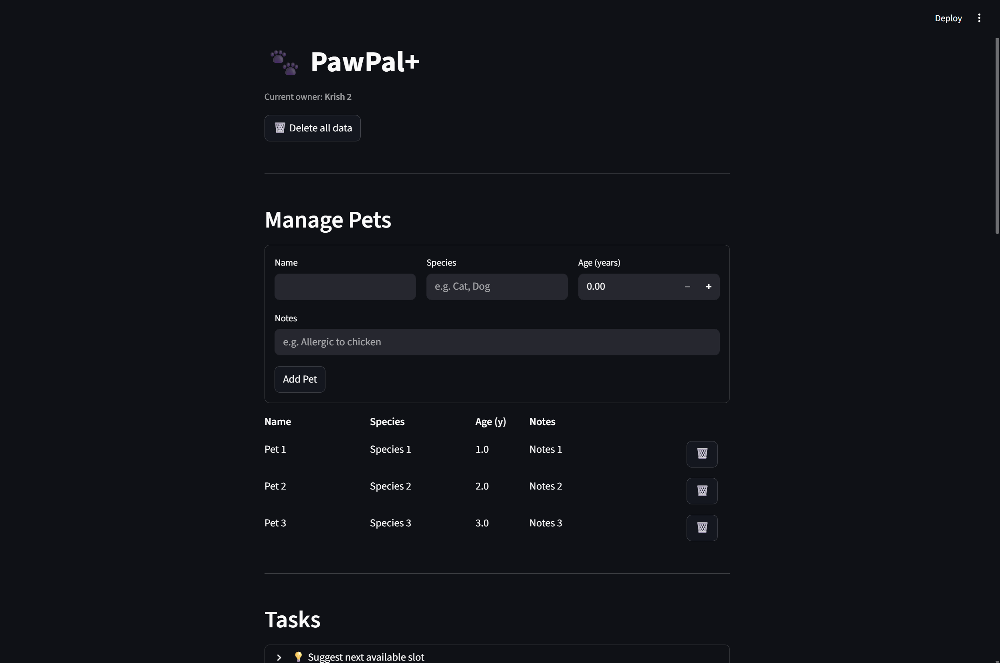
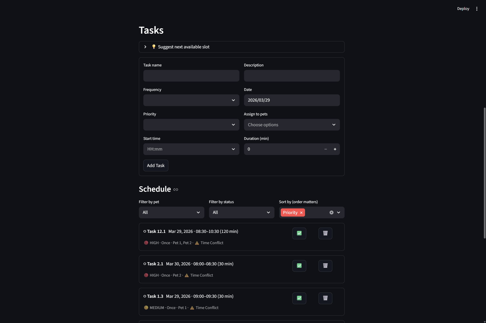

# PawPal+ (Module 2 Project)

## Future Ideas
* Fully-fledged log-in system

# Old

You are building **PawPal+**, a Streamlit app that helps a pet owner plan care tasks for their pet.

## Scenario

A busy pet owner needs help staying consistent with pet care. They want an assistant that can:

- Track pet care tasks (walks, feeding, meds, enrichment, grooming, etc.)
- Consider constraints (time available, priority, owner preferences)
- Produce a daily plan and explain why it chose that plan

Your job is to design the system first (UML), then implement the logic in Python, then connect it to the Streamlit UI.

## Features

- Basic pet and task info
- Sort tasks by priority or date
- Filter tasks by pets and completion status
- Automatically create the next occurrence for recurring tasks when marking them as done
- Scheduling conflict warnings
- **Bonus**: Suggest next available time slot for a certain pet based on tasks already made for that pet with time and duration info
- **Bonus**: Sort by priority and time (either alone) with order importance
    - For example: priority then time, time then priority, just time, and just priority
- **Bonus**: Save data across page refreshes via a JSON file
- **Bonus**: Clean polished UI:
    - Tables for neatly displaying pets
    - Cards for neatly displaying tasks
    - Emojis for priorities, conflicts, delete buttons, and complete buttons for easy recognition
    - Color coded messages (e.g., red for errors)




## Testing PawPal+

```bash
pytest tests/test_pawpal.py
```

Confidence Level: 4.5/5

I'm very confident of the tests because they cover a lot of ground:

* Both storing by date/time and sorting by priority
* Both filtering by pets and completion status
* Conflict detection
    * Covering edge cases such as adjacent blocks
* Recurring events automatically creating new events upon completion
    * Covering once, daily, weekly, monthly, and yearly frequencies

However, there many be very small gaps in the coverage since no one is perfect, so I left room for that doubt via 4.5 instead of a 5.