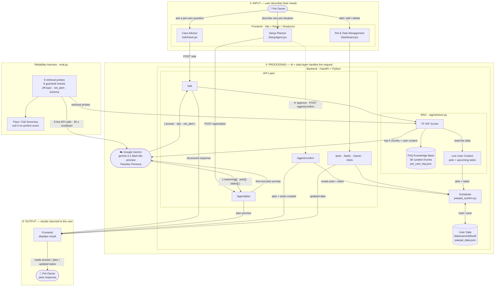

# PawPal++ — System Architecture Diagram

```mermaid
flowchart TD

    %% ─── ① INPUT ──────────────────────────────────────────────────────────────
    subgraph INPUT ["① INPUT — user describes their needs"]
        direction LR
        Human(["👤 Pet Owner"])
        subgraph FE ["Frontend  ·  Vite + React + Shadcn/ui"]
            Advisor["Care Advisor\nAskPanel.jsx"]
            Planner["Setup Planner\nSetupAgent.jsx"]
            PetTaskUI["Pet & Task Management\nDashboard.jsx"]
        end
        Human -->|"ask a pet-care question"| Advisor
        Human -->|"describe new pet situation"| Planner
        Human -->|"add / edit / delete"| PetTaskUI
    end

    %% ─── ② PROCESSING ─────────────────────────────────────────────────────────
    subgraph PROCESSING ["② PROCESSING — AI + data layer handles the request"]
        subgraph BE ["Backend  ·  FastAPI + Python"]
            subgraph Routers ["API Layer"]
                RAsk["/ask"]
                RPlan["/agent/plan"]
                RConfirm["/agent/confirm"]
                RCRUD["/pets · /tasks · /owner · /slots"]
            end
            subgraph RAGLayer ["RAG  ·  rag/retriever.py"]
                Retriever["TF-IDF Scorer"]
                FAQ[("FAQ Knowledge Base\n38 curated chunks\npet_care_faq.json")]
                UserCtx["Live User Context\npets + upcoming tasks"]
            end
            Scheduler["Scheduler\npawpal_system.py"]
            DataStore[("User Data\ndata/users/default/\npawpal_data.json")]
        end
        Gemini(["☁️ Google Gemini\ngemini-3.1-flash-lite-preview\nPawsley Persona"])
    end

    %% ─── ③ OUTPUT ─────────────────────────────────────────────────────────────
    subgraph OUTPUT ["③ OUTPUT — results returned to the user"]
        direction LR
        FE_R["Frontend\ndisplays result"] -->|"reads answer / plan / updated tasks"| Human_R(["👤 Pet Owner\nsees response"])
    end

    %% ─── Reliability Harness (side channel) ───────────────────────────────────
    subgraph EvalHarness ["Reliability Harness  ·  eval.py"]
        EvalTests["6 retrieval probes\n8 guardrail checks\noff-topic · vet_alert · schema"]
        EvalOut["Pass / Fail Summary\nexit 0 on perfect score"]
    end

    %% ── INPUT → PROCESSING ─────────────────────────────────────────────────────
    Advisor -->|"POST /ask"| RAsk
    Planner -->|"POST /agent/plan"| RPlan
    Planner -.->|"✅ approve · POST /agent/confirm"| RConfirm
    PetTaskUI --> RCRUD

    %% ── RAG flow ───────────────────────────────────────────────────────────────
    RAsk --> Retriever
    Retriever --> FAQ
    Retriever -->|"read live data"| UserCtx
    UserCtx -->|"pets + tasks"| Scheduler
    Retriever -->|"top-4 chunks + user context"| Gemini
    Gemini -->|"{ answer · tips · vet_alert }"| RAsk

    %% ── Agentic flow ───────────────────────────────────────────────────────────
    RPlan -->|"free-text plan prompt"| Gemini
    Gemini -->|"{ reasoning[] · pets[] · tasks[] }"| RPlan
    RConfirm -->|"create pets + tasks"| Scheduler

    %% ── CRUD flow ──────────────────────────────────────────────────────────────
    RCRUD --> Scheduler
    Scheduler <-->|"load / save"| DataStore

    %% ── PROCESSING → OUTPUT ────────────────────────────────────────────────────
    RAsk -->|"structured response"| FE_R
    RPlan -->|"plan preview"| FE_R
    RConfirm -->|"pets + tasks created"| FE_R
    RCRUD -->|"updated data"| FE_R

    %% ── Eval ───────────────────────────────────────────────────────────────────
    EvalTests -->|"retrieval probes"| Retriever
    EvalTests -->|"8 live API calls · 30 s cooldown"| Gemini
    EvalTests --> EvalOut
```
